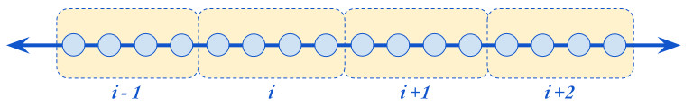

# 🗑 The "buckets" Library 🗑

A library that implements common bucketing (or binning) strategies.
Bucketing strategies can be constructed using direct library calls or created from a text-based specification.

Bucketing (a.k.a. binning or discretization) is the practice of partitioning a continuous or high-cardinality domain into a finite set of intervals or categories, then aggregating statistics per interval.

At the time of this writing, the library is available only for the Go programming language.
The intent is to provide implementations in other common programming languages over time. 

## Concepts

The following are concepts used by the library that will explain how the various stategies work.

### What is a Bucket?

A *Bucket* is a continuous range of real number values that can be mapped to an integer *index*. Together, the buckets created by a bucketing strategy should cover all real numbers from -∞ to +∞. 

For a given real number $v$, it is possible to calculate what bucket that number falls in to. Likewise, given a bucket index $i$ it is possible to determine the range of values contained in that bucket.

Bucketing is used to simplify the analysis of large datasets and reason about the distribution of values. 

### Indexes

In this library, signed integer values are used for indexes. Typically negative indexes are used for buckets that contain negative numbers, and positive indexes cover positive numbers. This is not a hard requirement; it is possible to create bucketing strategies that map values to buckets however you like.

### Mapping Functions & Alignment

The main thing that distinguishes different bucketing strategies is the *Mapping Function* $f$ the strategy uses. This is a function that maps an index $i$ to a real value. It defines one side of the boundary of bucket $i$.

The value $f(i)$ is always included in bucket $i$.

Which side of the bucket it defines is determined by the strategy's *Alignment*. A left-aligned bucketing strategy will define bucket $i$ to be the interval $\left[ f(i), f(i+1) \right)$. 
A right-aligned strategy would define the bucket $i$ to be the inverval $\left( f(i-1), f(i) \right]$.

The different mapping functions supported by this library are described below.
### Overflow & Underflow Buckets

In practice, the number of buckets you can have are limited by the integer datatype of the index. For example, if your indexes are 16-bit integers, then you can have at most 65536 buckets. Because of this it is useful to reserve two special buckets called the *Overflow* and *Underflow* buckets.   

In this library, the overflow bucket has index `MAX_INT` and is used for all values greater than the interval for bucket `MAX_INT - 1`. Likewise, the underflow bucket has index `MIN_INT` and is used for all values less than the interval for bucket `MIN_INT + 1`.

## Using the Library

The library is pretty simple, and used in two steps:
1. Construct a `BucketingStrategy` object.
2. Use the object to map:
   - Values to a bucket index, or:
   - Bucket index to the bounds of the bucket. 

### Buckets as Configuration

The easiest way to construct a `BucketingStrategy` with the desired properties is to use a *Configuration Spec*, which is a string that contains the information that the library needs to build the object for you.

This spec takes the form: `"strategy:param1=value1,param2=value2,…"`. It is meant to be stored as part of your application's configuraiton settings and constructed at runtime. The [Strategies](#strategies) section below contains the details of the spec for each support strategy.

A `BucketingStrategy` in created from a spec string using the library's `Parse` method. Consult the API documentation for your programming language for the deatils of how to use it.

### Buckets as Code

If you know the bucketing strategy you'd like to use at compile time, then you can also create its `BucketingStrategy` using a constrcutor method. The list of constructor methods is language-specific, can be found in the API documentation for that language.

### Mappings

Once you have a `BucketingStrategy` object, all the methods you need to map values to buckets and vice-versa are available through that interface. Please consult the provided API documentation for your programming language for details on how to use it.

## Strategies

The library ships with the following bucketing strategies by default:

### Fixed Width

The simplest strategy is one where every bucket has a fixed width.

The spec for this strategy uses the name `"fixed"` and supports the following properties:
* `width` (float) = the width of the buckets. (Default: `1.0`)
* `origin` (float) = the value that should be used as the starting point for generating buckets. (Default: `0.0`)
* `align` (str) = either `left` or `right`. (Default: `right`)   

For example, the spec `"fixed:width=10,align=left"` will create a bucketing strategy that has the buckets:

| Index | Range |
| --- | --- |
| -1  | `[-10,0)` 
| 0 | `[0,10)` |
| 1 | `[10, 20)` |
| ... | ... |

### Linear

Coming soon!

### Polynomial

Coming soon!

### Exponential

Coming soon!

